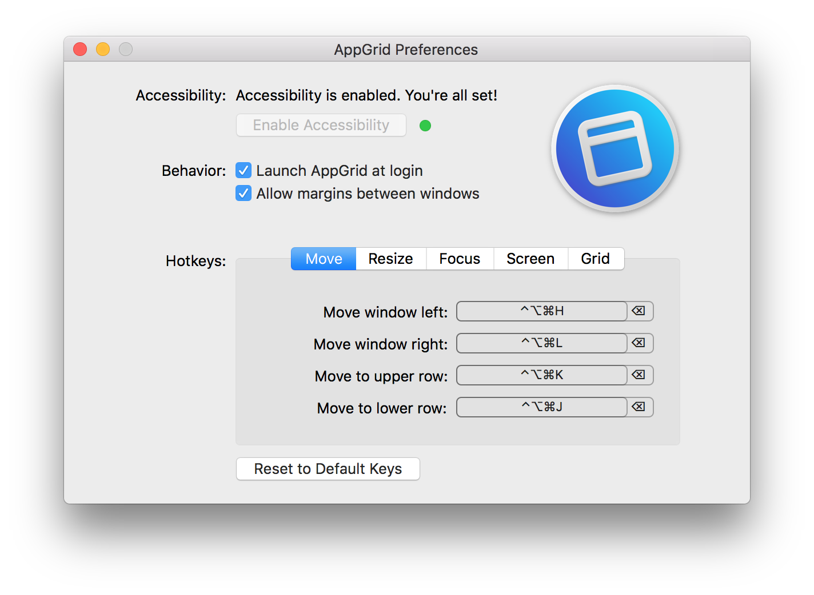

AppGrid
-------

*Grid-based keyboard window manager for Mac Os Ten*

[Download the app (.zip)](https://github.com/sdegutis/AppGrid/releases/download/1.0.3/AppGrid.zip)

- Move and resize windows along an invisible "grid" of your screen.
- Keys default to Mash (cmd + ctrl + opt) and Vim keys, but are customizable.

---

---

If you have found this app useful, please [donate](https://www.paypal.com/cgi-bin/webscr?business=sbdegutis@gmail.com&cmd=_donations&item_name=AutumnJS.app%20donation&no_shipping=1) to support development.

